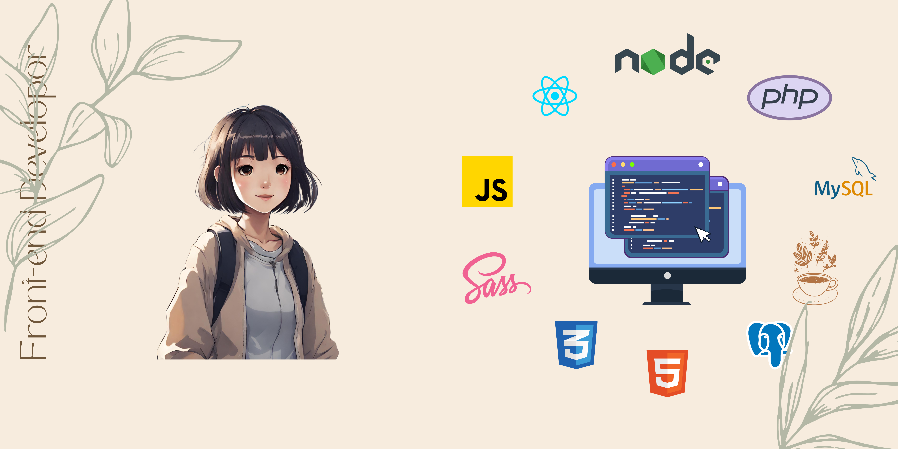

### Hi there 👋, My name is Amy

## 💻 About Me
I am a front-end developer with entry-level experience in web development. I'm eager to learn and apply my skills to a variety of projects. I'm also passionate about learning back-end development and looking forward to be a full stack web developer.
## ✏️ Example of Works
## 🛠️ Languages and Tools

  &nbsp;
  &nbsp;
  &nbsp;
  &nbsp;
  &nbsp;
  &nbsp;

